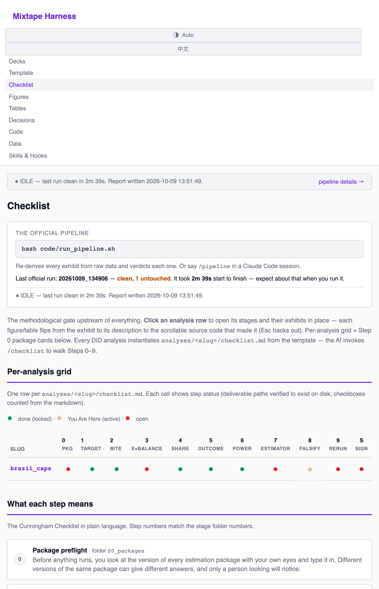

# GTD — a zero-error harness for causal-inference research

English | [中文](README.zh.md)



This repo is a **research harness**: interlocking rules, checklists, skills, guardrails, and a live
dashboard that keep an AI-assisted difference-in-differences project honest, reproducible, and resistant
to drift. It is a *template* — clone it, point it at your own study, and it enforces a zero-error
discipline as you work.

The problem it solves: when an AI can produce 200 lines of analysis in one shot, the human can no longer
verify line by line as they go. Production outran verification. This harness re-couples them. Every
figure traces to a script, every stage is gated, every claim is defended before it advances — and because
the human *and* the AI both drift (differently), the record lives on disk where neither's memory can lie.

It also installs into **DSH** (DeepSeek Harness) as two bundles, so the harness's skills appear in every
session's catalog and its guardrails fire on every tool call.

---

## Start here

1. **Read [`CLAUDE.md`](CLAUDE.md).** It is the law of the harness — written for the AI, but the human
   should read it too. Zero-error as a *constraint* rather than a goal, the stage "canisters," the
   "You Are Here" stage-lock model, provenance discipline, figure and deck standards.
2. **Open the dashboard.** `bash code/open_dashboard.sh` starts it if needed and prints the URL
   (`http://localhost:8080/`). It reads the filesystem on every request, so it is never stale, and it is
   the visual enforcement layer: stale outputs, unreviewed diffs, open gates and the pipeline's own
   verdicts are all shown in colour.
3. **Start a project.** `/newproject` scaffolds; then `/covariates` if the design is DiD, and walk
   `checklists/` one stage at a time. Each analysis lives in `analyses/<slug>/` with per-stage rooms.

---

## Install under DSH

Two bundles live in this repo. Install them from the DSH sidebar's **Plugins** page.

| Bundle | What it adds |
|---|---|
| **Skills + dashboard** (repo root) | the harness skills in every session's catalog, **and** a client half that opens the dashboard in the right-sidebar browser by itself |
| **Guardrails** (`dsh-guards/`) | the `hooks/` rules as native DSH guards — raw data immutable, no fabricated exhibit, no off-book exhibit, plus two advisories |

### From a git address

The install dialog accepts a package name, **a Git address**, a tarball, or an absolute local path. The
Git form is an ordinary repository URL — DSH's own example is `https://github.com/author/dsh-plugin`:

1. Sidebar → **Plugins** → **Add plugin**.
2. Paste the repository URL, for example `https://github.com/<owner>/<repo>`.
3. **Install**, then **Enable now** when it finishes.
4. Read the returned `application` field: **`applied`** is what means the change is live — not the
   server logs.
5. Start a **new session** and check the catalog for `amnesia`, `dashboard`, `pipeline`, `referee2`.

> **Git install for the guardrails bundle is not documented here as a URL**, because it lives in a
> *subdirectory* of this repo and the install dialog takes a package spec, not a subdirectory. Install it
> from a local checkout — `<path-to-checkout>/dsh-guards` — or split it into its own repository. The
> subdirectory form was **not verified**, so it is not claimed.

> **What was actually exercised.** Development and every verification in this repo went through the
> **local-path** route. The Git route follows DSH's own documented form and has **not** been run here — if
> you use it and it misbehaves, that difference is the first thing to suspect.

### From a local checkout

Same dialog, absolute path instead of a URL:

- repo root → the skills + dashboard bundle
- `<checkout>/dsh-guards` → the guardrails bundle

### The dashboard opens itself

The root bundle declares `dsh.client` and exports `./client`; the artifact is
[`lib/client.js`](lib/client.js), a hand-written bundle in the shape DSH's own plugin-authoring template
uses (`window.__ModuleLoader__.load({ id, factory })`, factory returns `{ inject, apply }`) — no bundler
step.

It polls the dashboard's `/api/health`, which carries an `instance` id that changes on every dashboard
start. So:

- **a newly activated dashboard opens one right-sidebar Browser tab by itself**; and
- **a reload does not open another**, because the instance is unchanged and already recorded. A plugin
  that popped a tab on every reload would be worse than no plugin.

Nothing happens while the dashboard is down — that is its normal state. The Browser tab type must exist
for the call to succeed: it is enabled on Desktop and **disabled by default in Web profiles** (add
`- id: ui-sidebar-browser` / `disabled: false` to the profile patch to enable it).

If you would rather not have the client half, `bash code/open_dashboard.sh` plus the `/dashboard` skill
give you the same thing with one click.

### Rollback and upgrades

Remove the bundle on the same Plugins page — nothing inside this repo changes. Installed plugins **do not
update automatically**: upgrading means uninstalling and installing the new version.

Client bundles hot-reload while a page is open, so an edit to `lib/client.js` takes effect without a
restart. A restart *is* needed the first time a newly declared `dsh.client` is activated.

---

## Worked example: one full DiD run, end to end

The repo ships a **walked, runnable example** so the discipline can be seen rather than described: the
Brazil **CAPS mental-health reform** (Dias & Fontes 2024, *AEJ: Economic Policy* 16(3): 257–289), used by
the [Mixtape-Sessions Causal-Inference-2](https://github.com/Mixtape-Sessions/Causal-Inference-2) labs.

```bash
# 1. get the data and seal it read-only (see Data, below)
curl -L -o /tmp/brazil.dta \
  https://github.com/scunning1975/mixtape/raw/master/brazil.dta
RAW_DIR=data/raw bash scripts/intake-raw.sh /tmp/brazil.dta

# 2. run the whole official pipeline: 10 steps, ~160 s
bash code/run_pipeline.sh

# 3. look at it
bash code/open_dashboard.sh      # prints http://localhost:8080/
```

`run_pipeline.sh` is the contract the `/pipeline` skill expects: it fingerprints every tracked artifact,
runs every official step from raw data, fingerprints again, and writes
`audits/pipeline_runs/run_<stamp>.json` with a per-artifact verdict — **confirmed** (reproduced
byte-identically), **changed** (the prior version was wrong), **missing**, **untouched**, **new**.

### What the run produced

```
  pipeline        10 steps, all clean, 159 s
                  26 confirmed · 0 changed · 0 missing · 1 untouched
  sample          5,476 municipalities · 296 always-treated (2002, excluded)
                  3,836 never-treated · 1,344 analysis-treated (2003–2016)
  bite            psychiatric admissions   17.66 → 10.47 per 10k   (−41%)
                  schizophrenia subset      7.97 →  3.43 per 10k   (−57%)
  estimator       simple ATT  +0.2098 (SE 0.0654) · dynamic +0.2746 (SE 0.1346)
                  210 / 210 ATT(g,t) cells finite, 0 NA
  placebo         deaths of despair: −0.0145 (SE 0.0355), p = 0.684   ← null, as it should be
  outputs         9 figures · 6 tables · 1 note recording the step that could not run
```

### What it found — including the uncomfortable parts

This is a harness whose whole purpose is to surface problems rather than bury them, so the example is
published **with its open gates visible**:

| Gate | Status |
|---|---|
| **Sign of the ATT** | The estimate is **positive** — adoption associated with *more* homicides — the **opposite** of the published result. Unreconciled, and reported as such rather than smoothed over. |
| **Estimator version** | Installed `did` 2.1.1 against upstream 2.5.1. This is not paperwork: `aggte()` returns no variance-covariance matrix, so **Step 8d (HonestDiD sensitivity) could not run at all**. Substituting the influence function was tested and does not reproduce the reported standard errors (~21% spread), so no `sigma` was invented. |
| **Events per variable** | 7 of 14 cohorts fall below the checklist's floor of 7 treated units per covariate; the smallest is 3.62. The estimator returned 210/210 finite cells anyway — "it ran" and "it is identified" are different claims. |

The dashboard shows these as **red**, not as green: no stage is `LOCKED`, so nothing is signed off. That
is the point.

---

## Data

### The running example

`brazil.dta` — the Dias & Fontes (2024) replication panel.

| | |
|---|---|
| Shape | 82,140 municipality-years × 117 variables |
| Units | 5,476 municipalities, 2002–2016 |
| Size | ~39 MB, Stata release 118 |
| SHA-256 | `a90429b8d135050afdd6d51cccec5d4a2ba81f5096c5989de0d2f75b88f290c5` |

### Where it actually comes from

It is served by **`scunning1975/mixtape`**:

```
https://github.com/scunning1975/mixtape/raw/master/brazil.dta
```

It is **not** in the `Causal-Inference-2` repo. That repo's
`Lab/Brazil MH Checklist/brazil.R` fetches it from the URL above at runtime, which is how the course
labs get it. If a link ever breaks, that is the line to fix.

### Intake and seal

Raw data is **write-once**, and the harness enforces it twice — a guardrail refuses an agent write, and
POSIX permissions make the refusal physical:

```bash
RAW_DIR=data/raw bash scripts/intake-raw.sh /tmp/brazil.dta   # the one sanctioned door
bash scripts/verify-raw.sh data/raw                            # re-check against the fingerprint
```

`intake-raw.sh` unseals, copies, re-seals (files `444`, directories `555`) and refreshes
`data/raw.manifest.sha256`. It refuses to overwrite an existing raw file; `--replace` is a loud,
deliberate act. `--hard` hands ownership to `root`, which even you need `sudo` to change.

Every derived panel is rebuilt by a script from the sealed raw file, and each one writes a **ledger**
saying how many rows came in, how many went out, and why any were dropped:

```
data/derived/panel_clean_notes.txt
  rows read (raw panel)                 : 82140
  municipality-years dropped, g == 2002 : 4440  (296 always-treated municipalities)
  rows written (panel_clean.csv)        : 77700
```

### Rules

- Never modify `data/raw/`. Every transform is code that writes to `data/derived/`.
- Figures → `output/figures/` (PDF + PNG); tables → `output/tables/`.
- No number enters prose except from a table file. No exhibit is fabricated; a labelled Monte Carlo is
  the one carve-out.
- Every figure and table must be readable by an intelligent layperson who has not read the paper: a
  descriptive title, units on the axes, sample and period in the subtitle, and a caption on the
  dashboard card back.

---

## Requirements

| For | Needs |
|---|---|
| The dashboard | **Python 3** (standard library only — no pip install) |
| The example pipeline | **R** with `did`, `HonestDiD`, `haven`, `data.table`, `ggplot2`, `sf`, `panelView` |
| `node test.mjs` | **Node 18+** (no dependencies) |
| Installing under DSH | DSH itself |

The example was walked on R 4.1.2, where `did` was **2.1.1** against an upstream **2.5.1**. That gap is
recorded as an open gate rather than hidden, and it is why Step 8d is blocked — check your own versions
before trusting any estimate.

---

## The map

| Path | What it is |
|---|---|
| `CLAUDE.md` | The harness law — read first. |
| `checklists/` | The DiD / continuous-DiD / synth checklists every analysis walks. Templates; never edited. |
| `analyses/` | One folder per analysis. `_template/` is the scaffold; its `stages/` are the checklist steps (`00_packages` … `09_rerun`, plus `S_signoff`). |
| `skills/` | The instruments — `amnesia`, `newproject`, `covariates`, `pipeline`, `referee2`, `blindspot`, `drift-sweep`, `bibcheck`, `dashboard`, and more. |
| `hooks/` | The guardrails that *enforce* the rules as Claude Code hooks: `protect-raw-data`, `no-fabricated-exhibit`, `no-offbook-exhibit`, `deck-from-pipeline`, `no-stale-canon`. |
| `dsh-guards/` | Those same rules ported to native DSH guards. `node dsh-guards/test.mjs`. |
| `dashboard_server.py` | The live dashboard — checklist grid, figures, tables, code, the pipeline's verdicts, a live run strip, and an EN/中文 toggle. |
| `code/run_pipeline.sh` | The official pipeline. Fingerprints, runs every step, verdicts each artifact. |
| `code/open_dashboard.sh` | Start the dashboard if it is not running; print its URL. |
| `lib/client.js` | The DSH **client** half: opens the dashboard in the right-sidebar browser when it is activated. |
| `index.js` + `cordis.patch.yml` + `package.json` | The DSH **host** half: finds its own `skills/` and mounts DSH's local skill provider on it. |
| `test.mjs` | `node test.mjs` — 101 checks, no DSH install required: bundle shape, self-location, every skill's frontmatter, a real `node:vm` evaluation of the client half, and the bilingual README pair. |
| `scripts/` | Helpers: `intake-raw.sh`, `seal-raw.sh`, `verify-raw.sh`, and the R pipeline. |
| `STATE.md` | The always-current "where am I" orientation file. Read on entry, updated continuously. |
| `dsh-plugin/` | **Retired** — the first, machine-specific version of the skills bundle. Tombstone only. |

---

## The stage-lock model in one picture

Every stage is coloured by **one rule — a stage's colour IS its lock state**, like a mall map:

```
  GREEN = done   — the stage carries a LOCKED file (shut / signed off)
  AMBER = active — the ONE stage you are in ("You Are Here"); only ever one
  RED   = open   — everything else (not locked, not active)
```

To *work* a stage, unlock it (delete its `LOCKED` file). To move on, lock the room you are leaving and
point `ACTIVE_STAGE` at the next. Sign-off is just the final stage: locking it means the analysis is done.

The rule that makes it honest: **a checkbox is a verification, not an intention.** You may write down a
plan before the thing exists; you may not mark it complete until it is real and you have looked at it
with your own eyes. A stage that cannot be re-entered tomorrow is a stage where errors hide — so each one
is a *canister* holding its own `ideas.md`, `todo.md`, `findings.md` and `exhibits.md`.

---

## A note on the example

`CLAUDE.md`'s running example is the Brazil CAPS study. The repo shows the *shape* of a walked analysis —
and now also a real run of it, with its open gates in plain sight. Copy `analyses/_template/` (or run
`/newproject`) when you start your own.

The harness itself is domain-neutral: it works for any design where the missing counterfactual is Y(0).
